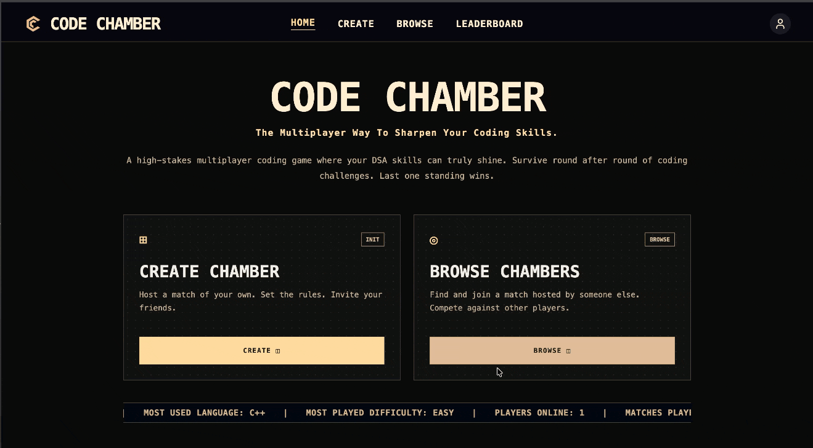
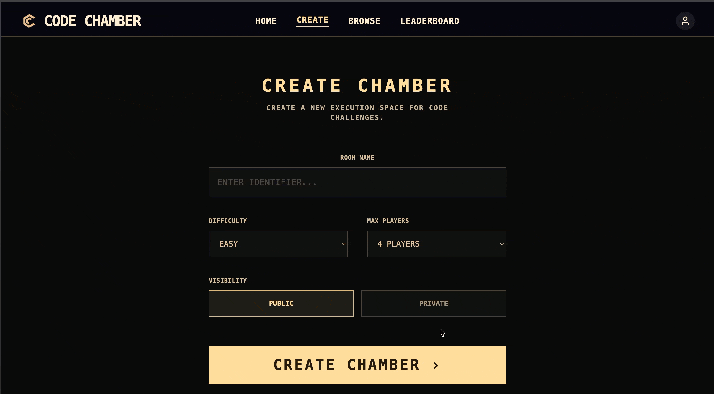
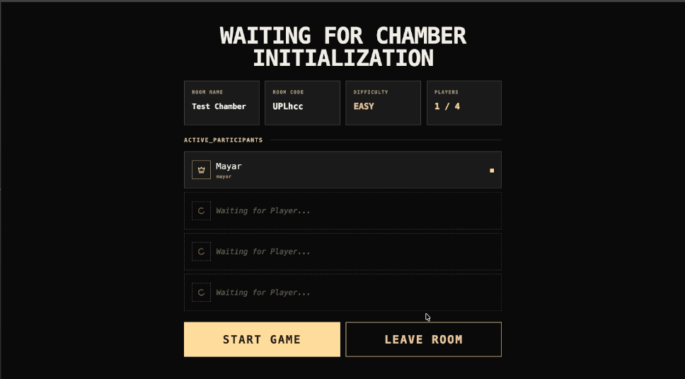
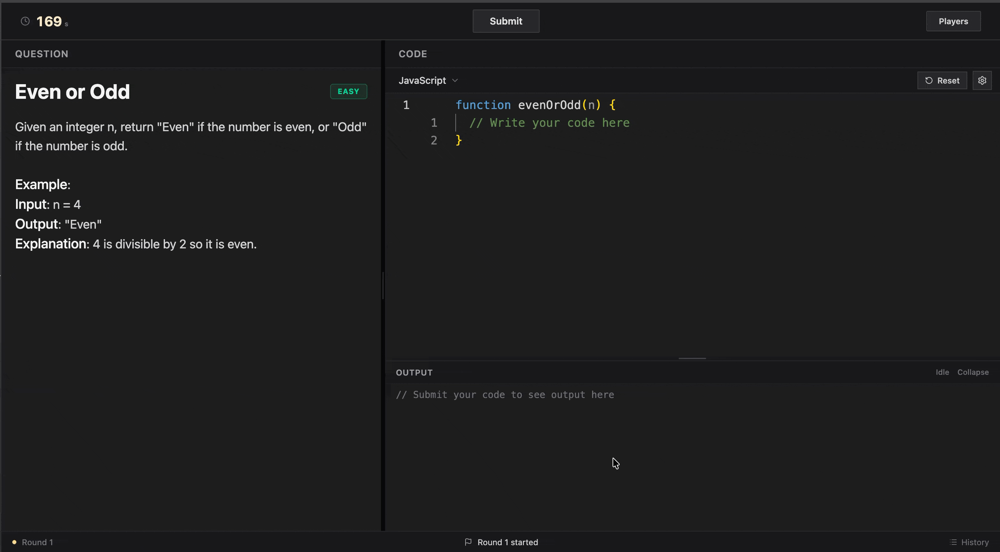
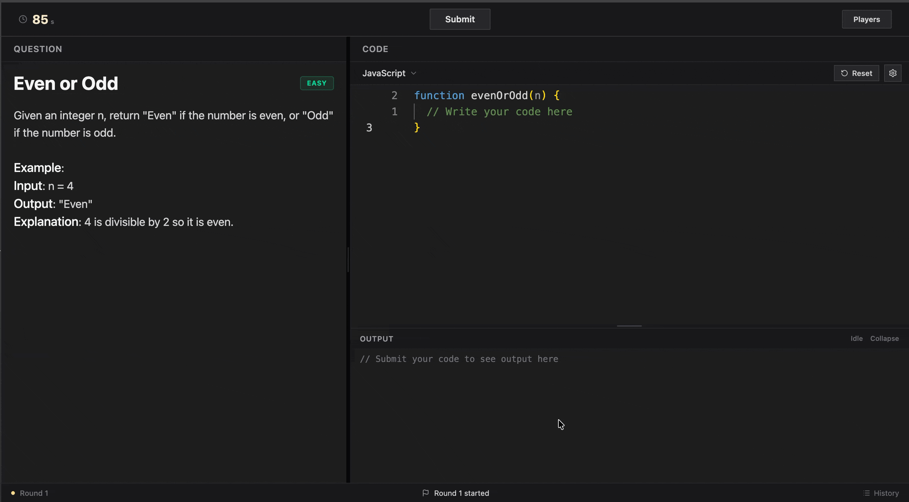
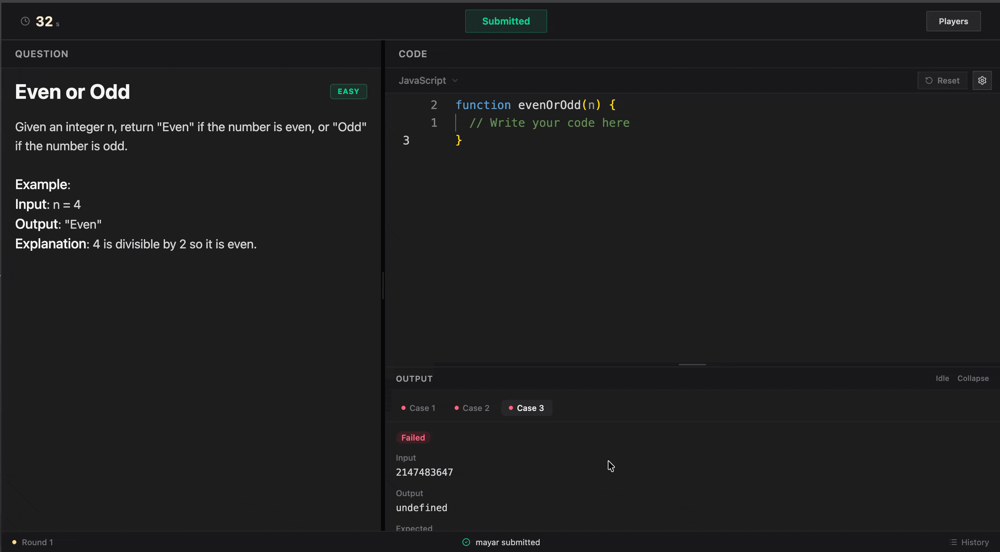
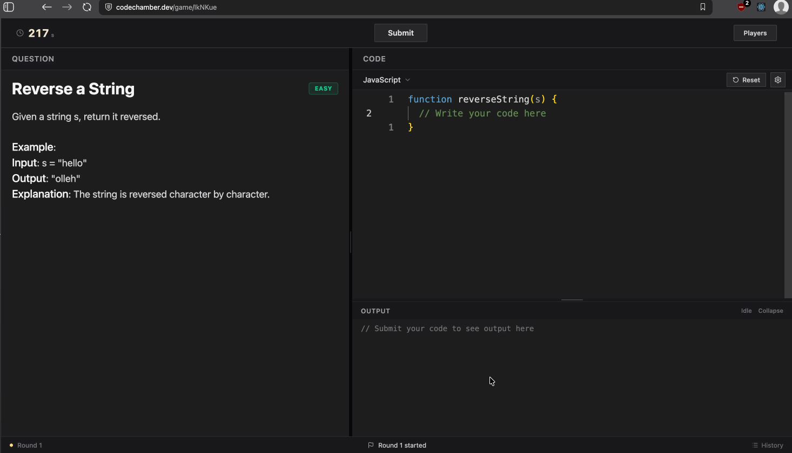
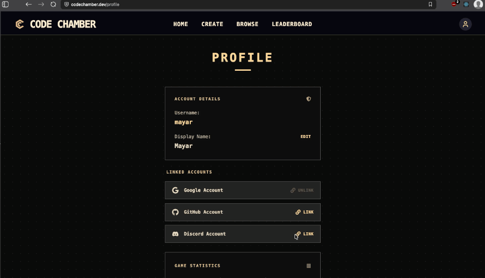
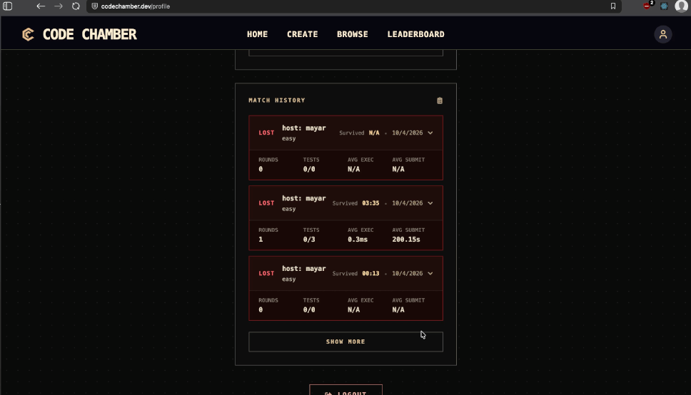
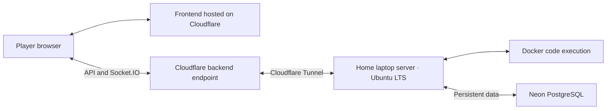

<div align="center">

# Code Chamber

**A real-time multiplayer coding game: solve, survive, and be the last player standing**

[](https://react.dev)
[](https://nodejs.org)
[](https://www.postgresql.org)
[](https://www.docker.com)
[](https://www.cloudflare.com)

[▶ Play Code Chamber](https://codechamber.dev)

</div>

---

## 📖 Overview

Code Chamber turns coding challenges into a multiplayer elimination game. Players join a room, solve the same problem against the clock, and submit real code in **JavaScript, Python, or C++**. Submissions are executed on the server against test cases, scored, and used to determine who survives the round.

Correctness, submission speed, and execution time all contribute to your score. Elimination is randomized and weighted by that score, so better performance improves your chances of survival without guaranteeing safety. Random round events add double eliminations, shorter timers, and narrow escapes. The game continues until one player remains.

The project brings together a browser-based code editor, real-time multiplayer state, containerized code execution, authentication, persistent player statistics, and a self-managed deployment on a laptop server at home.

Inspired by LeetCode-style coding challenges, Code Chamber started with a simple idea: make solving coding problems multiplayer and fun. Timed rounds, live competition, and unpredictable eliminations turn individual practice into a shared survival game.

---

## 🎬 Demos & GIFs

### Home Page



*Touring the home page, with shortcuts to create or browse chambers, live platform statistics, and a preview of the global rankings.*

<br><br>

### Creating and Joining Chambers



*Creating a chamber by choosing its name, difficulty, player limit, and public or private visibility, then entering the waiting lobby.*

<br><br>



*A guest joins a public chamber, the lobby updates to show both players, and the host starts the match countdown.*

<br><br>

### Coding Workspace



*Switching between JavaScript, Python, and C++ to view each language's starter code for the same question.*

<br><br>



*Submitting a solution and inspecting individual failed test cases, including their inputs, actual outputs, and expected outputs.*

<br><br>



*Opening the player list to see who has submitted and who is still working.*

<br><br>



*Resizing the question and editor panels and expanding or collapsing the output panel to adjust the coding workspace.*

<br><br>

### Profile Page



*Browsing account details, linked sign-in providers, game statistics, and a breakdown of submission performance by language.*

<br><br>



*Loading more match history and expanding a match to review its round submissions, language, difficulty, and performance details.*

---

## 🎮 How to Play

1. Visit [codechamber.dev](https://codechamber.dev) and play as a guest or sign in.
2. Browse public rooms, join with a room code, or create a public or private room.
3. Choose a difficulty and wait for the host to start the match.
4. Solve each round's problem in JavaScript, Python, or C++ before time runs out.
5. Submit your solution, review the results, and survive the elimination.
6. Keep surviving until you are the last player standing.

Standard round durations are **5 minutes for easy**, **7.5 minutes for medium**, and **10 minutes for hard**, with round events able to shorten the timer.

---

## ✨ Features

### 🏆 Multiplayer & Gameplay

- **Public and private rooms** — create a lobby with a name, player limit, and difficulty, or invite friends using a six-character room code.
- **Live room browser** — public lobby additions, player counts, updates, and removals arrive through Socket.IO.
- **Timed coding rounds** — shared questions, countdowns, submission status, results, and winner announcements follow a server-managed lifecycle.
- **Score-weighted elimination** — test-case success, submission time, and execution time affect survival odds.
- **Random round events** — double elimination, faster timers, and a missed bullet that spares a selected player.
- **Automatic submission** — when time expires, the server requests unfinished players' current code for judging.
- **Reconnection handling** — a brief grace period lets disconnected players rejoin, with the current game phase and submission status restored.

### 💻 Coding Experience

- **Monaco Editor** — an embedded editor with syntax highlighting and language-specific starter code.
- **Three supported languages** — JavaScript, Python, and C++17, including server-side C++ compilation.
- **Drafts preserved when switching languages** — change languages during a round without losing each language's current code.
- **Persistent editor preferences** — font size, tab size, language choice, and relative line-number settings saved locally.
- **Detailed submission feedback** — test-case inputs, expected and actual outputs, execution timing, debug output, and compilation or runtime errors.
- **Editor error locations** — generated wrapper offsets are accounted for when reporting error lines back to the player.
- **Resizable workspace** — adjust the split between the question and editor panels.
- **Client-side anti-cheat measures** — Game blocks copy, cut, paste, and drag-and-drop, and reverts edits that insert too many characters at once. These checks run locally without additional server requests, discouraging copied solutions while keeping network traffic low.

### 👤 Accounts & Progress

- **Guest play** — join games without creating an account; persistent statistics are reserved for registered players.
- **Multiple sign-in options** — username and password, Google, GitHub, and Discord through Better Auth.
- **Player profiles** — persistent submission and match statistics backed by PostgreSQL.
- **Match history** — review previous matches, round submissions, and outcomes.
- **Global leaderboards** — rankings across multiple metrics, with language and difficulty filters where applicable.
- **Live platform statistics** — server-sent events deliver updates without repeated client polling.
- **Account deletion** — account removal includes cleanup of player info in db, without breaking other players' match history that
include the deleted account.

---

## 🧠 Technical Highlights

### Containerized Code Execution

Running player-written code is central to the game. Each submission uses a Docker container configured with no network access, a read-only root filesystem, restricted writable temporary directories, dropped Linux capabilities, and limits on memory, CPU, and process count.

Language-specific wrappers accept test-case arguments as JSON, call the submitted function, and return structured output and timing information. C++ submissions are compiled against a custom wrapper before execution. The judge compares outputs with expected values and returns individual test-case results to the player.

A pool of ready containers reduces startup work during submissions. Containers are removed after use and replaced in the background. Per-language semaphores and bounded test-case concurrency control execution load, while retry logic and periodic orphan cleanup manage container failures and lifecycle cleanup.

### Coordinating a Real-Time Match

A round has to coordinate more than a timer: players submit at different times, code execution finishes asynchronously, and some submissions may still be processing when the deadline arrives.

The server manages countdowns, deadlines, submission eligibility, pending judging work, automatic submissions, scoring, and elimination. Socket.IO delivers phase changes and player status updates to each room, keeping everyone informed as players move from coding to judging to results.

If every player finishes submitting early, the round timer ends early. When time expires, manual submissions close, the server requests unfinished players’ current code, and pending judging work completes before scores and eliminations are calculated. This prevents results from being finalized while submissions are still being processed

### Reconnection Without Losing the Match

A disconnect can happen during the countdown, while a player is coding, while their submission is being judged, or during results. Each phase needs different recovery behavior, making reconnection more involved than simply reopening a socket.

The server briefly preserves the disconnected player’s place in the match. If they reconnect within the grace period, it attaches their existing player record to the new socket, restores room membership, and sends a snapshot of the current game phase and submission status so the interface can recover.

Round transitions also coordinate with reconnecting players and pending submissions before processing results. If the grace period expires, the player is removed and the match continues. This keeps temporary connection loss from immediately ending a player’s game while preventing abandoned connections from holding up the match indefinitely.

### Separating Live State from Persistent Records

Active rooms and round state live in server memory, while PostgreSQL stores users, sessions, questions, starter code, solutions, test cases, submissions, eliminations, and match outcomes.

This keeps active gameplay state immediately available to the multiplayer systems while retaining records for profiles, leaderboards, and match history. Numbered SQL migrations track schema changes, and a separate seed script loads the question dataset.

### Reducing Repeated Work

Public-room broadcasts are batched every **500 ms**, combining changes and retaining the latest update for each room. Leaderboard results are precomputed every **60 seconds** across language and difficulty combinations, allowing API requests to read cached rankings instead of rerunning all aggregation queries.

Live platform statistics use a separate precomputation process and a server-sent event stream. REST endpoints also apply rate limits, including separate limits for sensitive authentication actions.

---

## 🌐 Self-Hosted Deployment

I deployed Code Chamber myself. The backend and Docker execution environment run on **my own laptop server at home, running Ubuntu LTS**. The frontend is hosted on **Cloudflare**, and **Neon provides the PostgreSQL database**.

Backend traffic passes through **Cloudflare Tunnel**. The home server establishes an outbound connection to Cloudflare, and clients send API and Socket.IO traffic to the Cloudflare-facing endpoint. This keeps clients from connecting directly to the home server, avoids exposing its origin IP through the application's public endpoint, and adds Cloudflare as a protective layer in front of the backend. See [Cloudflare's tunnel documentation](https://developers.cloudflare.com/cloudflare-one/networks/connectors/cloudflare-tunnel/) for the connection model.

Here's the model described visually:



---

## 🛠️ Built With

| Technology | Purpose |
|---|---|
| React | Frontend pages, game interface, and shared application state |
| Vite | Frontend development server and production builds |
| Tailwind CSS | Interface styling |
| Monaco Editor | Browser-based coding workspace |
| Framer Motion | Interface animations |
| Node.js & Express | Backend APIs and game orchestration |
| Socket.IO | Real-time lobbies, gameplay events, and reconnection |
| Better Auth | Sessions, email/password authentication, and social sign-in |
| PostgreSQL & Neon | Persistent accounts, questions, submissions, and match records |
| node-postgres & Kysely | Database queries, connection pooling, and authentication database integration |
| Docker | Isolated language execution environments |
| JavaScript, Python & C++17 | Supported player submission languages |
| Cloudflare & Cloudflare Tunnel | Frontend hosting and proxied access to the home backend |
| Ubuntu LTS | Operating system on the home laptop server |
| Vitest & React Testing Library | Backend unit tests and frontend component and hook tests |

---

## 📂 Project Structure

```text
code-chamber/
├── client/
│   ├── src/
│   │   ├── components/       # Navigation, route guards, editor, and game UI
│   │   ├── context/          # Session, player, server health, and live stats
│   │   ├── hooks/            # Shared hooks and game event handling
│   │   ├── layouts/          # Main and game layouts
│   │   ├── pages/            # Lobbies, gameplay, accounts, and leaderboards
│   │   ├── test/             # Frontend test setup and shared mocks
│   │   ├── utils/            # Timer and timeout utilities
│   │   ├── App.jsx           # Root application component
│   │   ├── main.jsx          # Frontend entry point
│   │   ├── router.jsx        # Application routes
│   │   ├── authClient.js     # Authentication client
│   │   ├── socket.js         # Socket.IO client and connection handling
│   │   └── index.css         # Global styles
│   ├── .env.example          # Frontend environment template
│   ├── package.json          # Frontend dependencies and scripts
│   └── vite.config.js        # Vite, React, Tailwind, and test configuration
├── server/
│   ├── broadcast/            # Batched public-room updates
│   ├── executor/             # Docker pool, judging, and language configuration
│   │   └── cpp/              # C++ wrapper, helpers, and executor Dockerfile
│   ├── game/                 # Match startup, departure, and reconnection
│   │   └── round/            # Round lifecycle, submissions, scoring, and elimination
│   ├── leaderboard/          # Precomputed rankings
│   ├── liveStats/            # Precomputed platform statistics
│   ├── middleware/           # API rate limiting
│   ├── migrations/           # Versioned PostgreSQL schema
│   ├── room/                 # Lobby creation, membership, and cleanup
│   ├── routes/               # REST APIs and live statistics stream
│   ├── seed/                 # Question dataset
│   ├── socket/               # Socket authentication and event registration
│   ├── utils/                # Guest identities, player lists, and timer utilities
│   ├── index.js              # Backend startup
│   ├── app.js                # Express middleware and API routes
│   ├── server.js             # HTTP and Socket.IO server setup
│   ├── auth.js               # Authentication configuration
│   ├── db.js                 # PostgreSQL connection pool
│   ├── globals.js            # Shared in-memory room and player state
│   ├── shutdown.js           # Server shutdown handling
│   ├── migrate.js            # Database migration runner
│   ├── seed.js               # Question dataset loader
│   ├── .env.example          # Backend environment template
│   ├── package.json          # Backend dependencies and scripts
│   └── vitest.config.js      # Backend test configuration
├── package.json              # Root dependencies
├── README.md
└── LICENSE
```

---

## 🧪 Development & Testing

The client and server have separate dependency installations and scripts. Development requires a Node.js version compatible with the installed Vite version, a running Docker daemon, PostgreSQL, and the `psql` command-line client for seeding.

From the repository root:

```bash
npm ci
npm ci --prefix client
npm ci --prefix server

cp client/.env.example client/.env
cp server/.env.example server/.env

docker pull node:alpine
docker pull python:alpine
docker build -t cpp-executor:latest -f server/executor/cpp/cpp-executor.Dockerfile .
```

Configure the environment files before starting:

| File | Variables |
|---|---|
| `client/.env` | `VITE_APP_URL`: backend URL |
| `server/.env` | `PORT`, `DB_URL`, `FRONTEND_URL`, `BETTER_AUTH_URL`, `BETTER_AUTH_SECRET`, and Google/GitHub/Discord OAuth credentials |

The current authentication configuration uses secure cross-site cookies. For authenticated development, use HTTPS endpoints and matching OAuth callback URLs, or deliberately adapt the cookie configuration for your local environment.

Apply migrations and load questions from the `server` directory:

```bash
cd server
node migrate.js
node seed.js
npm run dev
```

In a separate terminal, start the frontend from the repository root:

```bash
npm run dev --prefix client
```

The frontend defaults to port **3000** and the backend to **5000**. Keep these aligned with the environment URLs.

Run the test suites or build the frontend from the repository root:

```bash
npm run test:ci --prefix server
npm run test:ci --prefix client
npm run build --prefix client
```

Tests cover room membership, round orchestration, submissions, scoring and elimination, reconnection, execution helpers, frontend pages, game hooks, and UI components.
> **Note:** Executor tests may take a few minutes to complete because they run each solution against its question’s test cases in every supported language using Docker containers.

---

## 📬 Contact

**Mayar Al Jawhary**

📧 [mayar.aljwh@gmail.com](mailto:mayar.aljwh@gmail.com)

💼 [LinkedIn](https://www.linkedin.com/in/mayar-al-jawhary-9b6497390/)

🐙 [GitHub](https://github.com/mayaralj)

---

## 📄 License

Code Chamber is licensed under the [MIT License](LICENSE).
